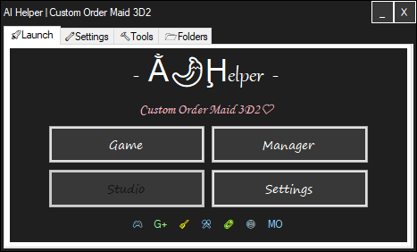

# AIHelper

 ● [English](README.md) ● [Русский](README_ru-RU.md)

## English description
### MO games manage helper for some Illusion/Kiss games
- The program was originally coded for personal use, to save time and for more convenient management of some assemblies with mods managed by Mod Organizer.

### Features
- Installing mods and resources
- Autodetect and fix conflicts in the list of mods
- Automatic update of plugins
- Auto-cleaning of the game folder from foreign files
- Autofix of some issues
- Ability to switch to normal mode when all the files in the game folder and back if you need to change mods.

#### Installation
 - Unpack to any folder
 - Run
 - Select target game exe (HS, KK, AI, HS2, RG, COM3D2)
 
 #### Links
 - The Discord Support Group opens by clicking the Discord icon on the Launch tab.
 

