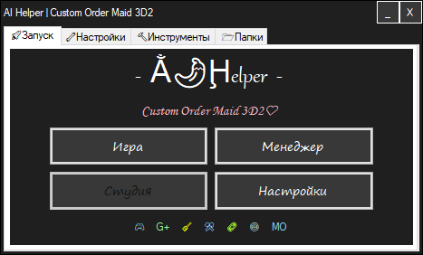

# AIHelper

 ● [English](README.md) ● [Русский](README_ru-RU.md)

## Описание на русском
### Помощник управления сборками игр под MO от Illusion/Kiss
- Изначально программа была написана для личного пользования, для экономии времени и более удобного управления некоторыми сборками с модами под управлением Mod Organizer.
 
### Функции
- Простое добавление игр
- Автоисправление конфликтов в списке модов
- Автообновление плагинов и модов
- Автоочистка папки игры от сторонних файлов
- Автоисправление проблем со сборками незаметно для пользователя
- Установка модов и ресурсов
- Возможность переключения в обычный режим, когда все файлы в папке игры и обратно, если нужно изменить моды.
 
#### Установка
 - Распаковать в любую папку
 - Запустить
 - Выбрать exe целевой игры (HS, KK, AI, HS2, RG, COM3D2)
 
#### Ссылки
- Группа поддержки в Дискорде открывается кликом по иконке Дискорда на вкладке Запуск программы.
 

